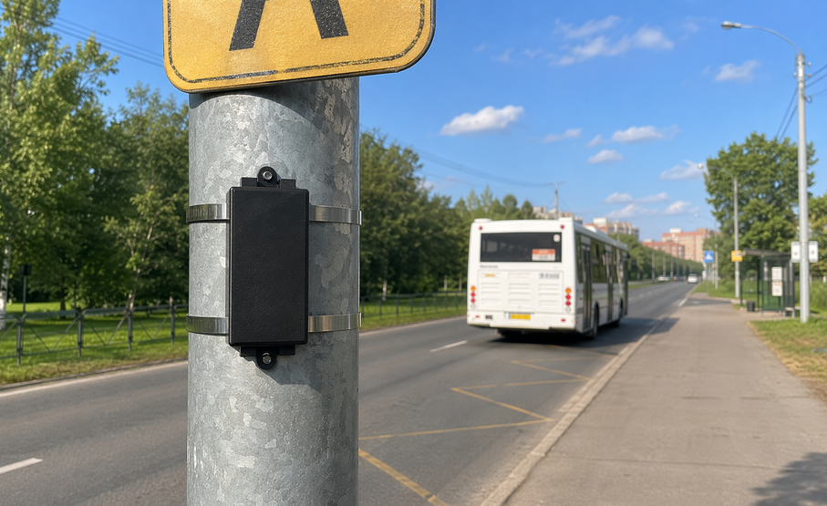
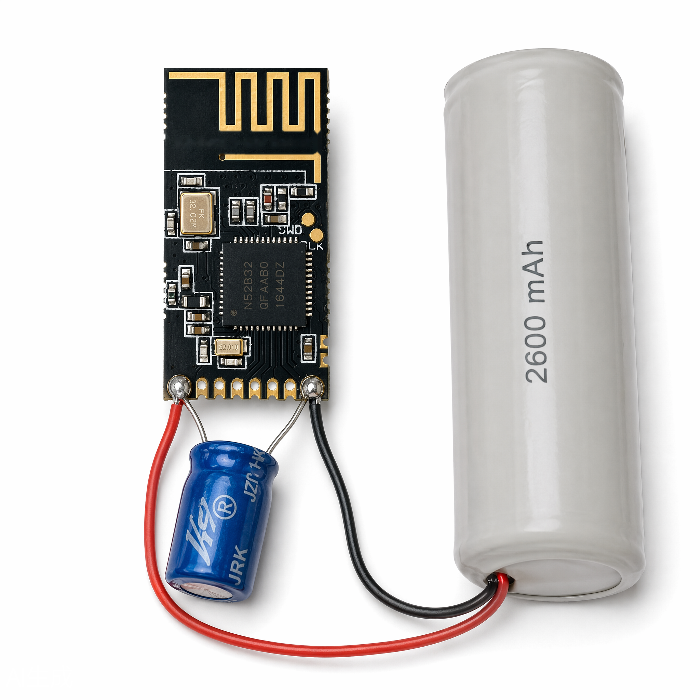
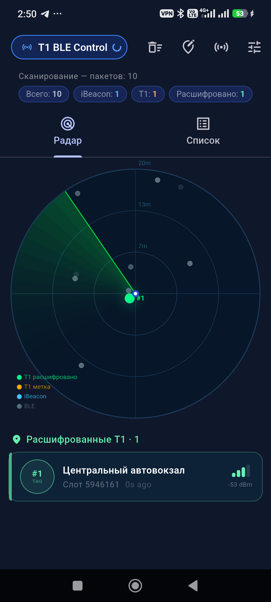
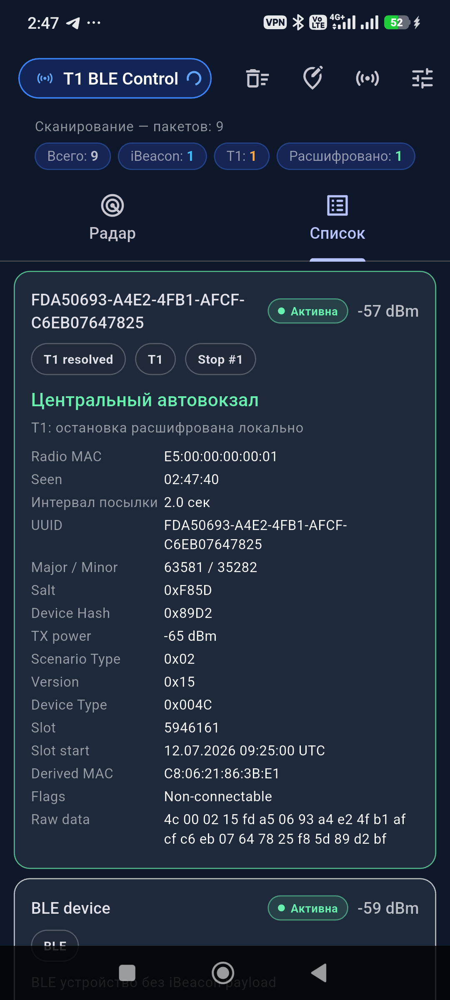
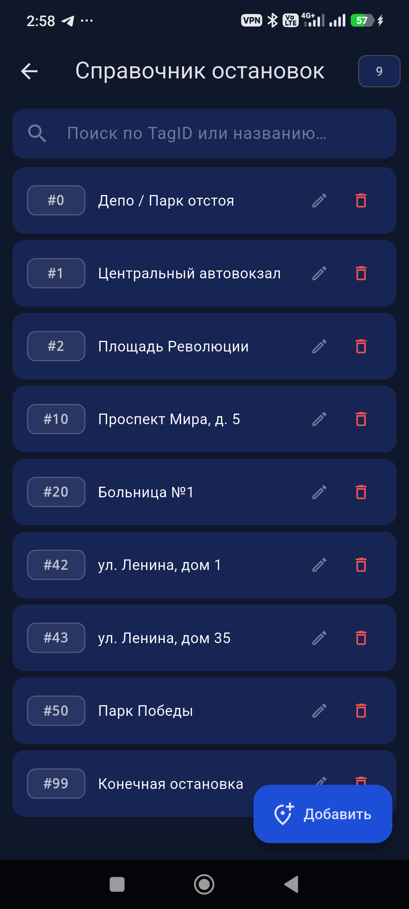
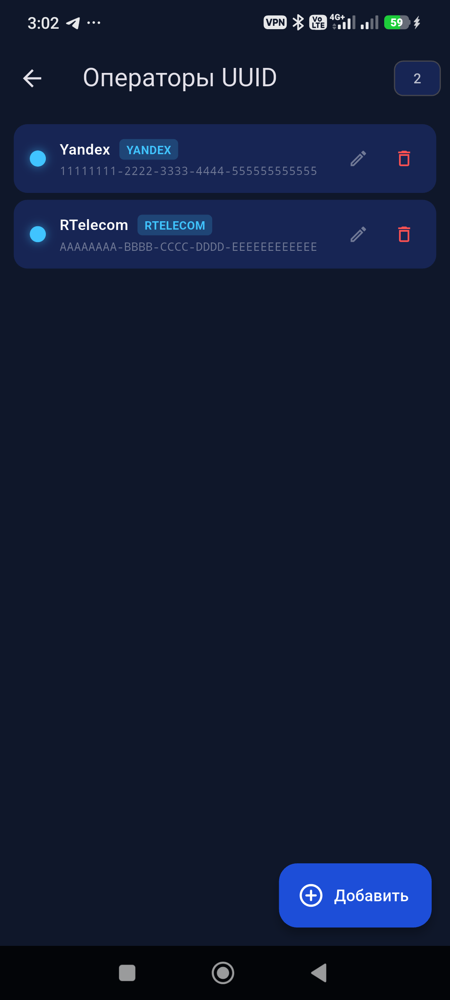

# Динамическая BLE-метка на nRF52832 ([YJ-16013](specs/YJ-16013-datasheet.pdf))



Автономная BLE-метка для локального позиционирования дорожных объектов и остановок транспорта.

Текущая модель:
- `iBeacon UUID` статичен и един для всех меток нашего оператора в регионе;
- `Major` и `Minor` меняются каждый слот (`5 мин`) по `AES-128 ECB`;
- сервер определяет оператора по `UUID`;
- для нашего `UUID` сервер локально восстанавливает `TagID`;
- для чужого `UUID` сервер маршрутизирует запрос на внешний REST оператора.

## Выбранная платформа: nRF52832 ([YJ-16013](specs/YJ-16013-datasheet.pdf))

| Параметр | Значение |
|---|---|
| Модуль | [YJ-16013](specs/YJ-16013-datasheet.pdf) |
| SDK | `nRF5 SDK 17.1.x`, SoftDevice `S112` |
| Режим BLE | `Broadcaster only` |
| Статичный параметр | единый `iBeacon UUID` оператора |
| Динамические параметры | `Major`, `Minor`, `RadioMAC`, служебный `MAC suffix` |
| Средний ток (дневной режим) | **~5.2 µА** (пробуждение каждые 2 с) |
| Средний ток (ночной режим) | **~1.1 µА** (пробуждение каждые 60 с) |
| Ресурс батареи `ER14505H` | **~15–20 лет** (ограничение по саморазряду) |



## Протокол работы

```
Каждые 2 секунды (или 60 с в ночном режиме):
  1. nRF52832 просыпается по RTC
  2. Проверяет текущий slot = unix_time / 300
  3. Если слот изменился — вычисляет новые Major/Minor/MAC по AES-128
  4. Передаёт один стандартный iBeacon-пакет
  5. Возвращается в System ON sleep (WFE)
```

> `unix_time` хранится в RAM и инициализируется из `TAG_INITIAL_UNIX_TIME` при каждом включении.
> После первой прошивки счётчик точен; после повторного включения батареи — снова начинает с
> `TAG_INITIAL_UNIX_TIME`. Мобильное приложение компенсирует это широким окном поиска слотов.

### Ночной режим

Если `TAG_NIGHT_MODE_ENABLE = 1`, в ночные часы метка переходит на интервал пробуждения **60 с**
вместо 2 с. `Major/Minor` продолжают меняться по 5-минутным слотам — только частота передачи падает.

| Параметр | Значение по умолчанию |
|---|---|
| `TAG_NIGHT_START_SEC` | 82800 (23:00 UTC+3) |
| `TAG_NIGHT_END_SEC` | 21600 (06:00 UTC+3) |
| `TAG_TIMEZONE_OFFSET_SEC` | 10800 (UTC+3) |
| `TAG_NIGHT_WAKE_INTERVAL_SEC` | 60 с |

В эфире:
- `UUID` — статичный, общий для оператора;
- `Major` и `Minor` — динамические;
- `TagID` в эфир не передаётся.

## Алгоритм генерации

На каждый слот выполняется один вызов `AES-128 ECB`:

```text
slot  = unix_time / 300
block = tag_id[2] || slot[4] || 0x00[10]
out   = AES-128-ECB(KEY, block)

major = out[0:2]
minor = out[2:4]
mac   = out[4:10]
mac[0] |= 0xC0
```

Статичный `UUID` оператора хранится в конфигурации прошивки и одинаков на всех наших метках.

Полная спецификация: [docs/algorithm.md](docs/algorithm.md)

## Маршрутизация на сервере

БНСО или BLE-сканер передают на сервер:
- `UUID`
- `Major`
- `Minor`
- `RSSI`
- `timestamp`

Дальше сервер работает так:

```text
1. Определить оператора по UUID.
2. Если UUID наш:
   - перебрать tag_id × [slot-1, slot, slot+1]
   - найти совпадение по Major/Minor
   - получить TagID
3. Если UUID чужой:
   - вызвать REST сервиса соответствующего оператора
   - получить TagID от него
```

Это позволяет сосуществовать в одном регионе нескольким операторам с разными статичными `UUID`.

## Интеграция с БНСО

Целевая интеграция:
- БНСО передаёт `UUID + Major + Minor + RSSI`;
- RNIS-сервер определяет оператора по `UUID`;
- дальнейшая идентификация зависит от оператора.

Легаси-режим тоже поддержан:
- `Умка`: `ID = Major * 65536 + Minor`
- `Скаут`: `ID = Major + Minor`

## Мобильное приложение — T1 BLE Scanner

**🔗 [github.com/sayr777/dynamic-iBeacon](https://github.com/sayr777/dynamic-iBeacon)**  
→ `mobile/t1_ble_scanner/` · [README](mobile/t1_ble_scanner/README.md) · [Release Notes](mobile/t1_ble_scanner/docs/RELEASE_NOTES.md) · [Product Page (PDF)](mobile/t1_ble_scanner/docs/T1_BLE_Scanner_Product.pdf)

Flutter-приложение для Android — автономный BLE-сканер с **локальной дешифровкой T1** на устройстве.

**Последний релиз: v1.4.1** — [скачать APK](https://github.com/sayr777/dynamic-iBeacon/releases/latest)

| Экран | Описание |
|---|---|
| 📡 Радар | Живой радар с RSSI-позиционированием, цвет по типу оператора |
| 📋 Список | Карточки устройств: UUID, major/minor, derived MAC, слот |
| 🛑 Остановки | Редактируемый справочник TagID → название |
| 🔷 Операторы | Реестр UUID-операторов с выбором цвета |
| ⚙️ Настройки | AES-128 ключ, режим, диапазон TagID |

<p>
  
  
  
  
</p>

**Особенности реализации:**
- Запускается в режиме **Production** по умолчанию (поиск по реальному unix_time)
- Окно поиска слотов `productionSlotWindow = 3000` (±10 дней) — компенсирует сброс unix_time при каждом включении метки
- AES-128 ECB дешифровка в Dart-изоляте — не блокирует UI
- Раундовые ключи разворачиваются один раз (≈5–10× быстрее наивной реализации)
- Дебаунс `notifyListeners` 100 мс — не более 10 перестроек UI/сек
- Офлайн — интернет не требуется

**Сборка:**
```
flutter run -d <device_id> --release   # Flutter 3.41.8, Dart 3.11.5
flutter analyze                        # No issues found ✓
```

Релизные APK собираются автоматически через **GitHub Actions** при публикации тега `v*`.
Подробнее: [.github/workflows/build-apk.yml](.github/workflows/build-apk.yml)

## Структура проекта

- [mobile/t1_ble_scanner/](mobile/t1_ble_scanner/) — Flutter-приложение для Android
- [docs/algorithm.md](docs/algorithm.md) — алгоритм генерации и серверной идентификации
- [docs/protocol.md](docs/protocol.md) — рабочий цикл метки и формат пакета
- [docs/architecture.md](docs/architecture.md) — архитектура изделия и серверная маршрутизация
- [firmware/README.md](firmware/README.md) — сборка и прошивка production-версии
- [firmware/tag_config.example.h](firmware/tag_config.example.h) — пример конфигурации (`TAG_ID`, `KEY`, `UUID`)
- [prototype/README.md](prototype/README.md) — TinyGo-прототип на ProMicro nRF52840
- [server/README.md](server/README.md) — серверный lookup и реестр операторов
- [server/lookup.py](server/lookup.py) — локальная идентификация и маршрутизация по операторам
- [server/operators.example.json](server/operators.example.json) — пример реестра операторов
- [server/lookup-pwa/](server/lookup-pwa/) — браузерный локатор для наших меток
- [docs/business-local-positioning.md](docs/business-local-positioning.md) — бизнес-документ
- [specs/README.md](specs/README.md) — спецификации и даташиты
- [manufacturing/FLASHING.md](manufacturing/FLASHING.md) — инструкция оператора по прошивке партии меток

## Связанные проекты

| Компонент | Назначение | Ссылка |
|---|---|---|
| **T1 BLE Scanner** | Android-приложение, офлайн-дешифровка | [mobile/t1_ble_scanner](mobile/t1_ble_scanner/) |
| **Прошивка** | nRF52832 iBeacon-метка | [firmware/](firmware/) |
| **Прототип** | TinyGo-стенд на ProMicro nRF52840 | [prototype/](prototype/) |
| **Сервер** | Lookup + маршрутизация операторов | [server/](server/) |

