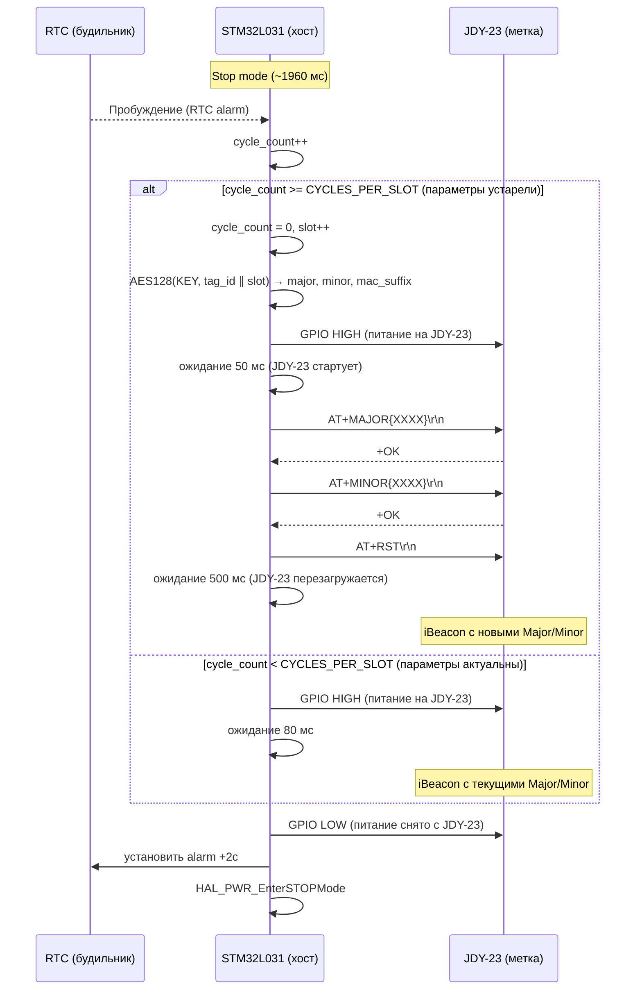
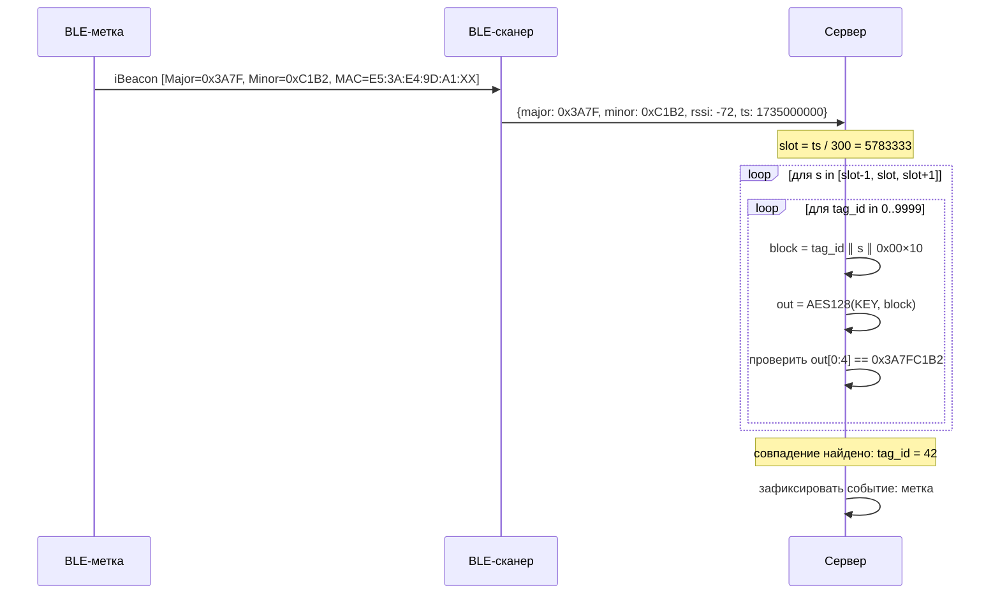

# Диаграммы взаимодействия

## Диаграмма состояний основного цикла

```mermaid
stateDiagram-v2
    direction TB

    [*] --> BOOT

    state BOOT {
        direction TB
        [*] --> init_platform : GPIO, UART, RTC
        init_platform --> load_config : TAG_ID, KEY, unix_time из Flash
        load_config --> init_jdy23 : первичный AT-профиль
        init_jdy23 --> [*]
    }

    BOOT --> CHECK_CYCLES : cycle_count = 0, slot = RTC / SLOT_DURATION

    state CHECK_CYCLES <<choice>>
    CHECK_CYCLES --> UPDATE_PARAMS : cycle_count ≥ CYCLES_PER_SLOT
    CHECK_CYCLES --> WAKE_JDY23 : cycle_count < CYCLES_PER_SLOT

    state UPDATE_PARAMS {
        direction TB
        [*] --> reset_counter : cycle_count = 0
        reset_counter --> inc_slot : slot++
        inc_slot --> aes_compute : block = tag_id ∥ slot ∥ 0x00×10
        aes_compute --> extract : out = AES128(KEY, block)
        extract --> [*] : major=out[0:2]  minor=out[2:4]  mac=out[4:7]
    }

    UPDATE_PARAMS --> WAKE_JDY23

    state WAKE_JDY23 {
        direction TB
        [*] --> gpio_high : GPIO_JDY_PWR = 1
        gpio_high --> wait_boot : ожидание 50 мс
        wait_boot --> [*]
    }

    WAKE_JDY23 --> SEND_BEACON

    state SEND_BEACON <<choice>>
    SEND_BEACON --> AT_UPDATE : params_changed == 1
    SEND_BEACON --> TX_WAIT : params_changed == 0

    state AT_UPDATE {
        direction TB
        [*] --> send_major : AT+MAJOR{XXXX}\r\n
        send_major --> send_minor : AT+MINOR{XXXX}\r\n
        send_minor --> send_rst : AT+RST\r\n
        send_rst --> wait_restart : ожидание 500 мс
        wait_restart --> [*] : params_changed = 0
    }

    AT_UPDATE --> SLEEP_JDY23
    TX_WAIT --> SLEEP_JDY23 : JDY-23 передаёт пакет (50–80 мс)

    state SLEEP_JDY23 {
        direction TB
        [*] --> gpio_low : GPIO_JDY_PWR = 0
        gpio_low --> [*]
    }

    SLEEP_JDY23 --> STOP_MODE

    state STOP_MODE {
        direction TB
        [*] --> set_rtc_alarm : RTC alarm +2с
        set_rtc_alarm --> enter_stop : HAL_PWR_EnterSTOPMode
        enter_stop --> [*] : пробуждение по RTC
    }

    STOP_MODE --> cycle_inc
    cycle_inc --> CHECK_CYCLES : cycle_count++
```



---

## Диаграмма последовательности (один полный цикл)



---

## Временная диаграмма потребления

```
Время (мс):
   0          50          130        2000
   |          |           |          |
   |__________| __________|          |
   GPIO_JDY   |  JDY-23   |          |
              |  active   |          |
              |           |__________|
                          MCU Stop
   
   Нормальный цикл:
   ├─ MCU active: 0..10 мс    (GPIO, логика, Stop-entry)
   ├─ JDY-23 active: 10..90 мс (boot + 1 ADV packet at 100 мс interval)
   └─ Stop mode: 90..2000 мс  (MCU + JDY off)

   Цикл обновления параметров (каждые 150 циклов = 5 мин):
   ├─ MCU active: 0..10 мс    (AES вычисление)
   ├─ JDY-23 + AT: 10..600 мс (boot + AT+MAJOR + AT+MINOR + AT+RST + restart)
   └─ Stop mode: 600..2000 мс
```

---

## Диаграмма идентификации на сервере


