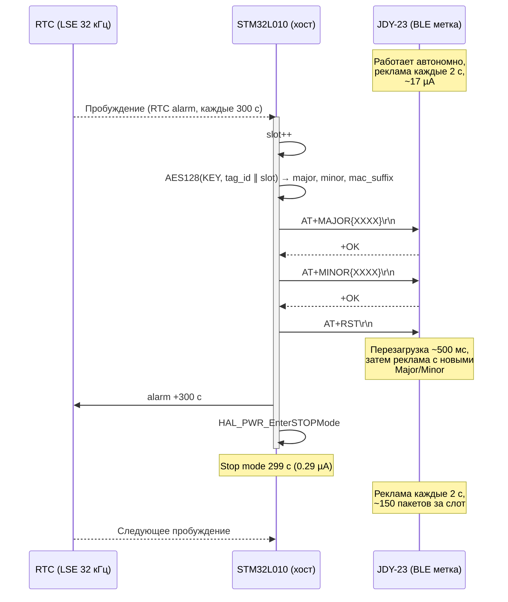
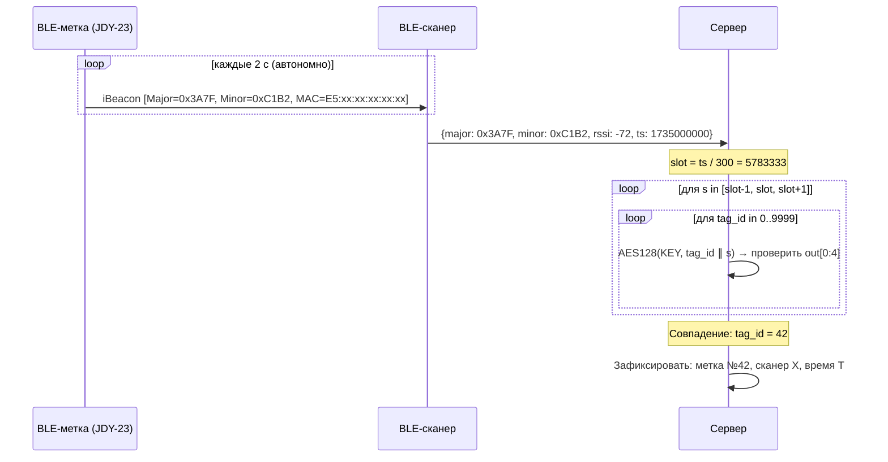

# Диаграммы взаимодействия

## Диаграмма состояний MCU

```mermaid
stateDiagram-v2
    direction TB

    [*] --> BOOT

    state BOOT {
        direction TB
        [*] --> init_platform : GPIO, UART, RTC (LSE)
        init_platform --> load_config : TAG_ID, KEY, unix_time из Flash
        load_config --> init_jdy23 : AT+VER (проверка связи)
        init_jdy23 --> [*]
    }

    BOOT --> UPDATE_PARAMS : slot = unix_time / SLOT_DURATION

    state UPDATE_PARAMS {
        direction TB
        [*] --> aes_compute : block = tag_id ∥ slot ∥ 0x00×10
        aes_compute --> extract : out = AES128(KEY, block)
        extract --> send_major : major = out[0:2]
        send_major --> send_minor : AT+MAJOR{XXXX}
        send_minor --> send_rst : AT+MINOR{XXXX}
        send_rst --> wait_restart : AT+RST
        wait_restart --> [*] : ожидание 600 мс
    }

    UPDATE_PARAMS --> STOP_MODE : MCU останавливается на 5 мин

    state STOP_MODE {
        direction TB
        [*] --> set_alarm : RTC alarm +300 с
        set_alarm --> enter_stop : HAL_PWR_EnterSTOPMode (0.29 µА)
        enter_stop --> [*] : пробуждение по RTC
    }

    STOP_MODE --> UPDATE_PARAMS : slot++

    note right of STOP_MODE
        JDY-23 работает АВТОНОМНО
        пока MCU спит:
        • реклама каждые 2 с
        • ~150 пакетов за слот
        • ~17 µА непрерывно
    end note
```



---

## Диаграмма последовательности (один слот = 5 мин)



---

## Временная диаграмма потребления

```
Время (с):
   0      0.6                               300
   │       │                                 │
   ┌───────┐                                 ┌───────┐
   │ MCU   │                                 │ MCU   │
   │ акт.  │                                 │ акт.  │
   └───────┘─────────────────────────────────┘
   2 мА    └──────── MCU Stop 0.29 µА ────────┘

   ═══════════════════════════════════════════
   JDY-23 ≈17 µА  (непрерывно, внутренний сон/реклама 2 с)

   ┌──┐  ┌──┐  ┌──┐     ┌──┐  ┌──┐  ┌──┐
   │  │  │  │  │  │ ... │  │  │  │  │  │   ← ADV пакеты JDY-23
   └──┘  └──┘  └──┘     └──┘  └──┘  └──┘
   0с   2с    4с         296с  298с  300с

   Средний ток:
   MCU:  (2мА × 0.6с + 0.29µА × 299.4с) / 300с = 4.3 µА
   JDY:  17 µА (постоянно)
   Итого: ~22 µА
```

---

## Диаграмма идентификации на сервере


