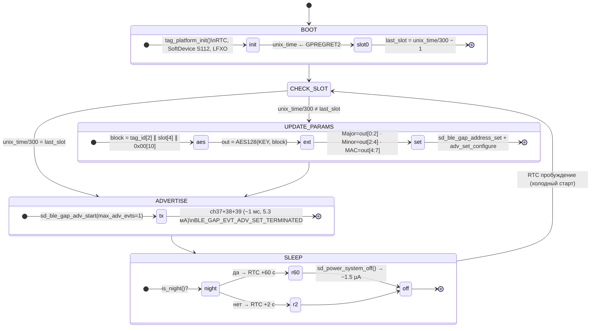
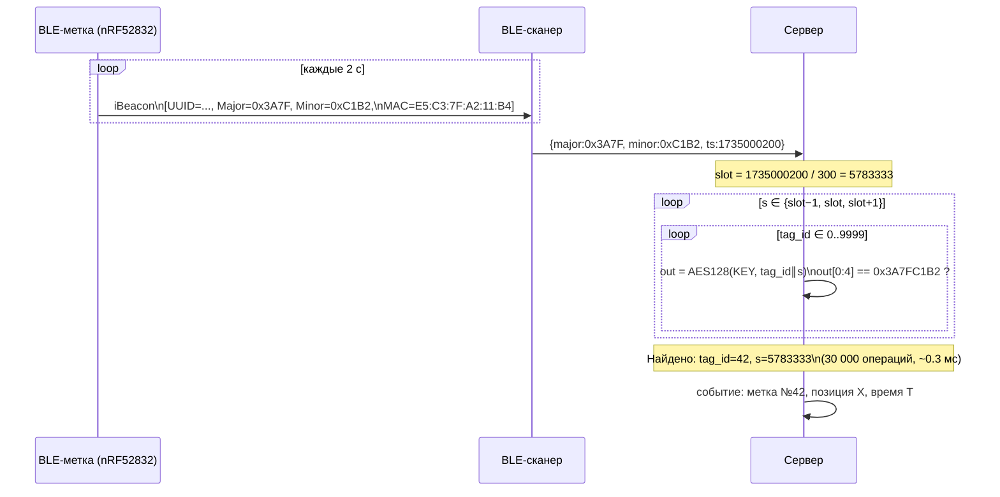

# Диаграммы взаимодействия

Платформа: **`YJ-16013` (nRF52832)**.  
Подробный протокол: [`protocol.md`](protocol.md)

---

## Диаграмма состояний FSM



---

## Диаграмма последовательности (один слот = 5 мин, 150 циклов)

```mermaid
sequenceDiagram
    participant RTC  as RTC (LFXO)
    participant MCU  as nRF52832
    participant AIR  as Эфир (BLE)
    participant SRV  as Сервер

    Note over MCU: System OFF ~1.5 µА

    RTC -->> MCU : пробуждение #1 (t=0 с)
    activate MCU
    MCU ->>  MCU : slot=unix_time/300 → граница слота!
    MCU ->>  MCU : AES128(KEY, tag_id∥slot) → Major, Minor, MAC
    MCU ->>  AIR : iBeacon ch37+38+39 (~1 мс)
    MCU ->>  MCU : sd_power_system_off()
    deactivate MCU
    Note over MCU: Sleep 1999 мс

    RTC -->> MCU : пробуждение #2 (t=2 с)
    activate MCU
    MCU ->>  MCU : slot не изменился
    MCU ->>  AIR : iBeacon ch37+38+39 (те же Major/Minor/MAC)
    MCU ->>  MCU : sd_power_system_off()
    deactivate MCU
    Note over MCU: ...

    Note over MCU,AIR: 148 пробуждений с теми же параметрами...

    RTC -->> MCU : пробуждение #150 (t=298 с)
    activate MCU
    MCU ->>  AIR : iBeacon ch37+38+39
    MCU ->>  MCU : sd_power_system_off()
    deactivate MCU

    Note over AIR,SRV: Сканер передаёт (Major, Minor, RSSI, ts) на сервер

    SRV ->>  SRV  : slot=ts/300; AES×30000 → tag_id=42 (<1 мс)
```

---

## Диаграмма идентификации на сервере



---

## Временна́я диаграмма потребления

```
Ток:
                    ┌──────┐
  5.3 мА │          │  TX  │
         │          │~1 мс │
  ~0 мА  │──────────┘      └───────────────────────────────────│
         │<──── AES + init ─>│<────── System OFF ~1999 мс ─────>│
         │     ~0.5 мс       │        nRF52832: ~1.5 µА         │
         │                   │        MCP1700:  ~1.0 µА         │
         0                                                   2000 мс

Дневной цикл (интервал 2 с):
  TX:    5.3 мА × 1 мс / 2000 мс   =  2.65 µА
  Sleep: 1.5 µА × 1999 мс / 2000   =  1.50 µА
  LDO:   1.0 µА (постоянно)         =  1.00 µА
  AES:   4.0 мА × 5 мс / 300 000   =  0.07 µА  (раз в 5 мин)
  ────────────────────────────────────────────
  Итого день:                        5.22 µА

Ночной цикл (интервал 60 с):
  TX:    5.3 мА × 1 мс / 60 000    =  0.09 µА  ← исчезает
  Sleep: 1.5 µА + 1.0 µА           =  2.50 µА
  ────────────────────────────────────────────
  Итого ночь:                        2.59 µА

Среднесуточный (17 ч день + 7 ч ночь):
  I = (5.22×17 + 2.59×7) / 24     = 4.40 µА
```
