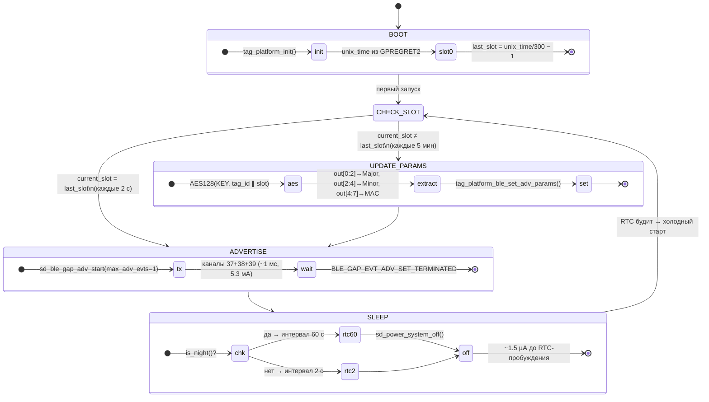
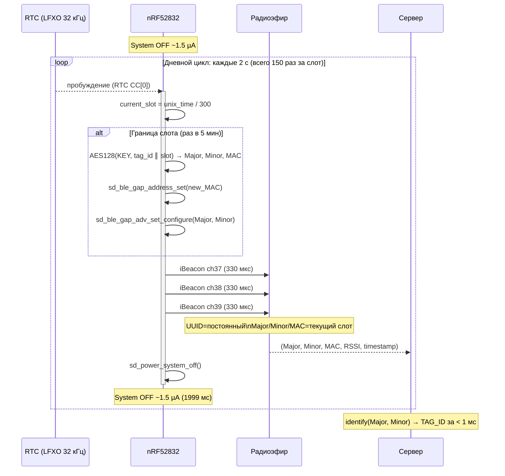
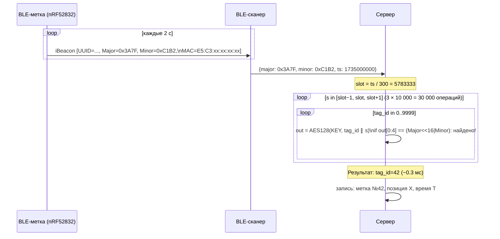

# Протокол работы метки

## Описание

Метка (`YJ-16013`, `nRF52832`) работает полностью автономно без какого-либо управления извне.

### Каждые 2 секунды (дневной цикл)

1. `nRF52832` просыпается из `System OFF` по `RTC` (`LFXO 32768 Гц`)
2. Передаёт **1 стандартный `iBeacon`-пакет** по трём каналам (`37`, `38`, `39`) — занимает ~1 мс
3. Засыпает обратно в `System OFF` (~1.5 µА до следующего пробуждения)

### Каждые 5 минут

4. При пробуждении: `current_slot = unix_time / 300`
5. Если `current_slot` изменился — вычисляет новые параметры: \
   `AES-128-ECB(KEY, tag_id[2] || slot[4] || 0x00[10])` → `Major[2]`, `Minor[2]`, `MAC_suffix[3]`
6. Обновляет `advertising payload` и `Random Static MAC` в BLE-стеке
7. Передаёт пакет с новыми параметрами

### Что постоянно, что меняется

| Поле | Изменяется | Период |
|---|---|---|
| `UUID` (16 байт) | ❌ постоянный | никогда |
| `Major` (2 байта) | ✅ | каждые 5 мин |
| `Minor` (2 байта) | ✅ | каждые 5 мин |
| `MAC`-адрес | ✅ | каждые 5 мин |
| `TAG_ID` (статичный) | ❌ | недоступен из эфира |

**Сервер** по паре `(Major, Minor)` восстанавливает `TAG_ID` без хранения истории,  
перебирая `AES128(KEY, tag_id || slot)` для всех `tag_id × [slot±1]` — < 1 мс.

---

## Диаграмма состояний FSM



---

## Диаграмма последовательности — один слот (5 мин)



---

## Диаграмма идентификации на сервере



---

## Временна́я диаграмма потребления (один 2-секундный цикл)

```
Ток (мА):
  5.3 │        ┌──┐
      │        │TX│  ~1 мс
  2.0 │        │  │
      │        │  │
      │        │  │
  0.0 ├────────┘  └────────────────────────────────┤
      │<─ старт ─>│<─────── System OFF 1999 мс ────>│
      │  ~0.5 мс  │           ~1.5 µА               │
      0                                           2000 мс

Средний ток за цикл:
  TX:    5.3 мА  × 1 мс     / 2000 мс  =  2.65 µА
  Sleep: 1.5 µА  × 1999 мс  / 2000 мс  =  1.50 µА  (nRF52832)
  LDO:   1.0 µА  × 2000 мс  / 2000 мс  =  1.00 µА  (MCP1700)
  AES:   4.0 мА  × 5 мс     / 300 000  =  0.07 µА  (раз в 5 мин)
  ─────────────────────────────────────────────────
  Итого днём:                              ~5.2 µА

Ночной режим (23:00–06:00, интервал 60 с):
  TX:    5.3 мА  × 1 мс     / 60 000 мс = 0.09 µА  ← исчезает
  Sleep: 1.5 µА  × ~60 с    / 60 с      = 1.50 µА
  LDO:   1.0 µА                          = 1.00 µА
  ─────────────────────────────────────────────────
  Итого ночью:                            ~2.59 µА
```

---

## Ночной режим

При `TAG_NIGHT_MODE_ENABLE = 1` и часовом поясе `TAG_TIMEZONE_OFFSET_SEC`:

```
local_sec = (unix_time + TZ_OFFSET) % 86400

23:00 ──────────────────────────── 06:00 → интервал 60 с
06:00 ──────────────────────────── 23:00 → интервал 2 с
```

Параметры `Major/Minor/MAC` по-прежнему меняются ровно раз в 5 мин —  
детекция по `unix_time / 300`, а не по счётчику циклов.

| | День (17 ч) | Ночь (7 ч) | Среднее за сутки |
|---|---:|---:|---:|
| Интервал | 2 с | 60 с | — |
| Средний ток | 5.2 µА | 2.6 µА | **4.4 µА** |
| Экономия vs без ночного режима | — | — | **−15%** |

---

## Формат iBeacon-пакета

```
AD-элемент (27 байт):
  [0]      0x1A  — длина (26)
  [1]      0xFF  — Manufacturer Specific Data
  [2..3]   0x4C 0x00 — Apple Company ID
  [4]      0x02  — Beacon Type
  [5]      0x15  — Beacon Length (21 байт)
  [6..21]  UUID (16 байт, постоянный)        ← TAG_IBEACON_UUID
  [22..23] Major (big-endian)                ← AES-вывод[0:2]
  [24..25] Minor (big-endian)                ← AES-вывод[2:4]
  [26]     RSSI @ 1m (−65 дБм)

MAC-адрес (Random Static, 6 байт):
  [5]  TAG_MAC_PREFIX[0] | 0xC0  ← биты 46..47 = '11' (BLE spec)
  [4]  TAG_MAC_PREFIX[1]
  [3]  TAG_MAC_PREFIX[2]
  [2]  AES-вывод[4]               ← меняется каждые 5 мин
  [1]  AES-вывод[5]
  [0]  AES-вывод[6]
```

---

## Тест на реальном оборудовании

**Платформа:** ProMicro NRF52840 v1940 (nice!nano clone), прошивка на TinyGo 0.40.1  
**Параметры теста:** TagID=42, SlotDuration=10s (ускоренный режим вместо 5 мин), AES-128 ECB  
**Дата:** 18 апреля 2026

### Вывод с платы (USB Serial, COM6)

```
========================================
BLE Tag  TagID=42   SlotDuration=10s
UUID     E2C56DB5-DFFB-48D2-B060-D0F5A71096E0
========================================
[slot    2] TagID=42  Major=0x4B10  Minor=0x545F  MAC=EB:F9:80:25:0E:94
[slot    3] TagID=42  Major=0x256A  Minor=0x7E30  MAC=C1:CC:71:D1:7F:82
[slot    4] TagID=42  Major=0xA410  Minor=0xA150  MAC=F0:EB:09:70:D9:86
[slot    5] TagID=42  Major=0x2C5C  Minor=0x8F92  MAC=DE:27:9D:15:76:C6
[slot    6] TagID=42  Major=0x305E  Minor=0xC636  MAC=D6:F4:13:DF:AC:28
[slot    7] TagID=42  Major=0xE896  Minor=0xFC0C  MAC=F0:F4:DE:0D:68:E3
```

### Что подтверждает тест

| Свойство | Результат |
|---|---|
| TagID=42 отсутствует в эфире | ✅ в пакете только UUID + Major + Minor |
| Major/Minor меняются каждый слот | ✅ все 6 строк — разные значения |
| MAC меняется каждый слот | ✅ каждый слот новый MAC-адрес |
| Старший байт MAC ≥ 0xC0 | ✅ `0xEB`, `0xC1`, `0xF0`, `0xDE`, `0xD6`, `0xF0` — биты 46-47 = `11` (Random Static) |
| Значения детерминированы | ✅ сервер с тем же KEY и TagID=42 вычислит те же значения |
| AES-128 ECB совместим с сервером | ✅ использована стандартная `crypto/aes` Go |
