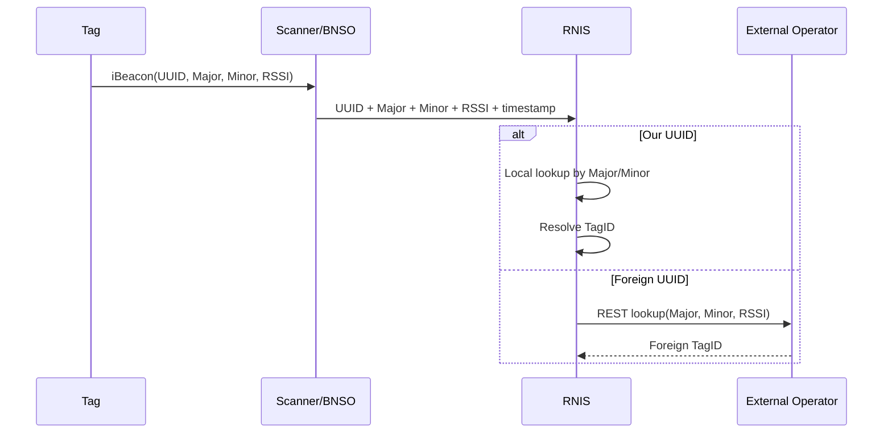

# Протокол работы метки

## Описание

Метка на [YJ-16013](../specs/YJ-16013-datasheet.pdf) работает автономно и не принимает команд из эфира.

## Рабочий цикл

### Каждые 2 секунды

1. `nRF52832` просыпается по `RTC`.
2. Проверяет текущий `slot = unix_time / 300`.
3. Если слот изменился, пересчитывает `Major` и `Minor`.
4. Передаёт один `iBeacon`-пакет.
5. Уходит в `System OFF`.

### Каждые 5 минут

При смене слота:

```text
block = tag_id[2] || slot[4] || 0x00[10]
out   = AES-128-ECB(KEY, block)

Major = out[0:2]
Minor = out[2:4]
```

## Что постоянно, что меняется

| Поле | Изменяется | Пояснение |
|---|---|---|
| `UUID` | нет | общий статичный UUID оператора |
| `Major` | да | меняется по AES каждый слот |
| `Minor` | да | меняется по AES каждый слот |
| `RadioMAC` | да | меняется через BLE Privacy |
| `TAG_ID` | нет | внутренний идентификатор, в эфир не передаётся |

## Формат iBeacon

```text
[0..1]    0x02 0x15
[2..17]   UUID (16 байт, статичный UUID оператора)
[18..19]  Major
[20..21]  Minor
[22]      Tx Power
```

## Серверная идентификация

### Предпочтительный путь

Сканер или БНСО передают:

```text
UUID, Major, Minor, RSSI, timestamp
```

Сервер:

```text
1. Определяет оператора по UUID.
2. Если UUID наш:
   - локально восстанавливает TagID по Major/Minor.
3. Если UUID чужой:
   - вызывает внешний REST оператора.
```

### Офлайн-идентификация (без сервера)

Реализована в **[T1 BLE Scanner](../mobile/t1_ble_scanner/)** — Android-приложении:
- AES-128 ECB выполняется локально на телефоне
- Перебор `tag_id × [slot-1, slot, slot+1]` в Dart-изоляте
- Результат: TagID, слот, derived MAC, название остановки
- Интернет не требуется
- **[github.com/sayr777/dynamic-iBeacon](https://github.com/sayr777/dynamic-iBeacon)**

### Легаси-путь

Если БНСО ещё не передают `UUID`, допускаются:
- `Умка`: `ID = Major * 65536 + Minor`
- `Скаут`: `ID = Major + Minor`

## Последовательность



## Ночной режим

Ночной режим, если включён, влияет только на частоту пробуждения.
Алгоритм смены `Major/Minor` остаётся привязанным к `unix_time / 300`.

