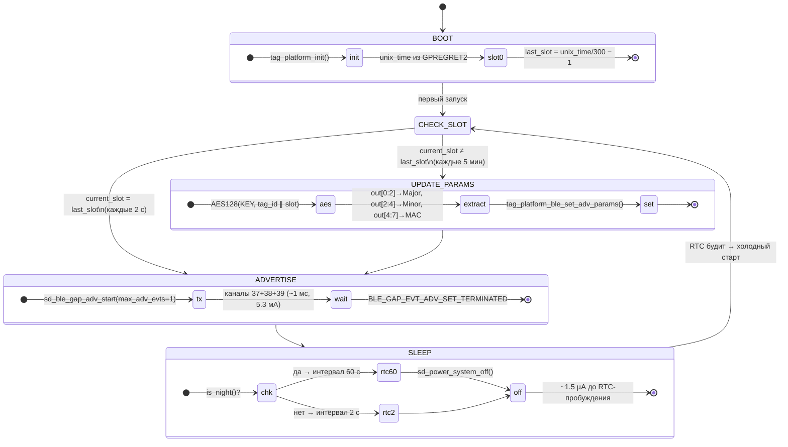
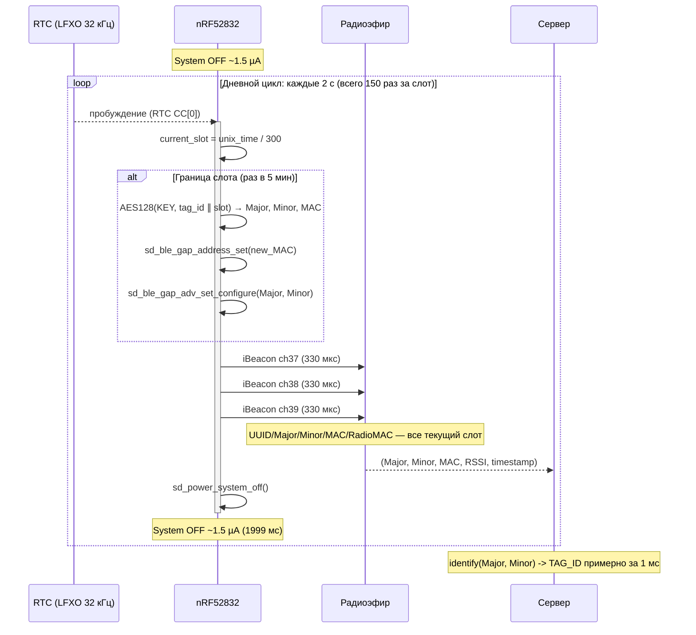
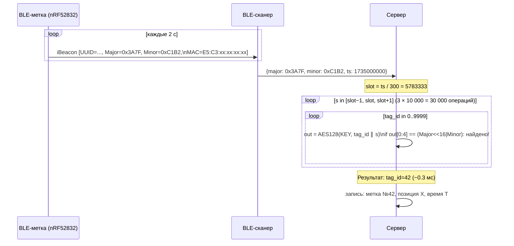

# Протокол работы метки

> Диаграммы FSM и sequence в альтернативном формате: [`docs/interaction-diagram.md`](interaction-diagram.md)  
> Полный расчёт ресурса батареи: [`docs/battery-life-estimate.md`](battery-life-estimate.md)

## Описание

Метка ([YJ-16013](../specs/YJ-16013-datasheet.pdf), `nRF52832`) работает полностью автономно без какого-либо управления извне.

### Каждые 2 секунды (дневной цикл)

1. `nRF52832` просыпается из `System OFF` по `RTC` (`LFXO 32768 Гц`)
2. Передаёт **1 стандартный `iBeacon`-пакет** по трём каналам (`37`, `38`, `39`) — занимает ~1 мс
3. Засыпает обратно в `System OFF` (~1.5 µА до следующего пробуждения)

### Каждые 5 минут

4. При пробуждении: `current_slot = unix_time / 300`
5. Если `current_slot` изменился — вычисляет новые параметры (2 вызова AES-128 ECB): \
   `variant=0`: `AES(KEY, tag_id[2]|slot[4]|0x00|0x00[9])` → `UUID[16]` \
   `variant=1`: `AES(KEY, tag_id[2]|slot[4]|0x01|0x00[9])` → `Major[2]`, `Minor[2]`, `MAC[6]`
6. Обновляет `advertising payload` (UUID, Major, Minor, MAC) в BLE-стеке
7. BLE Privacy (`sd_ble_gap_privacy_set`) меняет RadioMAC автоматически
8. Передаёт пакет с новыми параметрами

### Что постоянно, что меняется

| Поле | Изменяется | Период |
|---|---|---|
| `UUID` (16 байт) | ✅ | каждые 5 мин |
| `Major` (2 байта) | ✅ | каждые 5 мин |
| `Minor` (2 байта) | ✅ | каждые 5 мин |
| `MAC`-адрес (iBeacon payload) | ✅ | каждые 5 мин |
| `RadioMAC` (BLE Privacy) | ✅ | каждые 5 мин |
| `TAG_ID` (статичный) | ❌ | недоступен из эфира |

**Сервер** по тройке `(UUID, Major, Minor)` восстанавливает `TAG_ID` без хранения истории,  
перебирая два вызова `AES128(KEY, ...)` для всех `tag_id × [slot±1]` — < 1 мс.

---

## Диаграмма состояний FSM



---

## Диаграмма последовательности — один слот (5 мин)



---

## Диаграмма идентификации на сервере



---

## Временна́я диаграмма потребления (один 2-секундный цикл)

```
Ток (мА):
  5.3 │        ┌──┐
      │        │TX│  ~1 мс
  2.0 │        │  │
      │        │  │
      │        │  │
  0.0 ├────────┘  └────────────────────────────────┤
      │<─ старт ─>│<─────── System OFF 1999 мс ────>│
      │  ~0.5 мс  │           ~1.5 µА               │
      0                                           2000 мс

Средний ток за цикл:
  TX:    5.3 мА  × 1 мс     / 2000 мс  =  2.65 µА
  Sleep: 1.5 µА  × 1999 мс  / 2000 мс  =  1.50 µА  (nRF52832)
  LDO:   1.0 µА  × 2000 мс  / 2000 мс  =  1.00 µА  (MCP1700)
  AES:   4.0 мА  × 5 мс     / 300 000  =  0.07 µА  (раз в 5 мин)
  ─────────────────────────────────────────────────
  Итого днём:                              ~5.2 µА

Ночной режим (23:00–06:00, интервал 60 с):
  TX:    5.3 мА  × 1 мс     / 60 000 мс = 0.09 µА  ← исчезает
  Sleep: 1.5 µА  × ~60 с    / 60 с      = 1.50 µА
  LDO:   1.0 µА                          = 1.00 µА
  ─────────────────────────────────────────────────
  Итого ночью:                            ~2.59 µА
```

---

## Ночной режим

При `TAG_NIGHT_MODE_ENABLE = 1` и часовом поясе `TAG_TIMEZONE_OFFSET_SEC`:

```
local_sec = (unix_time + TZ_OFFSET) % 86400

23:00 ──────────────────────────── 06:00 → интервал 60 с
06:00 ──────────────────────────── 23:00 → интервал 2 с
```

Параметры `Major/Minor/MAC` по-прежнему меняются ровно раз в 5 мин —  
детекция по `unix_time / 300`, а не по счётчику циклов.

| | День (17 ч) | Ночь (7 ч) | Среднее за сутки |
|---|---:|---:|---:|
| Интервал | 2 с | 60 с | — |
| Средний ток | 5.2 µА | 2.6 µА | **4.4 µА** |
| Экономия vs без ночного режима | — | — | **−15%** |

---

## Формат iBeacon-пакета

```
AD-элемент (27 байт):
  [0]      0x1A  — длина (26)
  [1]      0xFF  — Manufacturer Specific Data
  [2..3]   0x4C 0x00 — Apple Company ID
  [4]      0x02  — Beacon Type
  [5]      0x15  — Beacon Length (21 байт)
  [6..21]  UUID (16 байт)    ← AES(KEY, tag_id|slot|variant=0)   — меняется каждый слот
  [22..23] Major (big-endian) ← AES(KEY, tag_id|slot|variant=1)[0:2]
  [24..25] Minor (big-endian) ← AES(KEY, tag_id|slot|variant=1)[2:4]
  [26]     RSSI @ 1m (−59 дБм)

MAC-адрес payload (Random Static, 6 байт):
  mac[0] = AES_v1_out[4] | 0xC0  ← биты 46..47 = '11' (BLE spec)
  mac[1] = AES_v1_out[5]
  mac[2] = AES_v1_out[6]
  mac[3] = AES_v1_out[7]
  mac[4] = AES_v1_out[8]
  mac[5] = AES_v1_out[9]         — все 6 байт меняются каждый слот

RadioMAC (BLE Privacy, Non-Resolvable Private Address):
  Управляется SoftDevice через sd_ble_gap_privacy_set()
  Меняется автоматически каждый слот (cycle_s = SLOT_DURATION в секундах)
```

---

## Передача данных через БНСО

Метка не взаимодействует с БНСО напрямую — БНСО пассивно принимает iBeacon и передаёт `Major`/`Minor` на сервер в агрегированном виде.

### Поток данных

```
[BLE-метка] ──iBeacon──▶ [БНСО в автобусе] ──GPRS/LTE──▶ [Телематическая платформа] ──API──▶ [lookup.py]
```

### Кодирование ID в БНСО

| Модель | Протокол | Поле в логе | Формула |
|---|---|---|---|
| **Умка** | Wialon IPS | `BLEID=ID0=…` | `ID = Major × 65536 + Minor` |
| **Скаут** | EGTS | тег BLE ID | `ID = Major + Minor` |

Пример строки от Умки:
```
BLEID=ID0=550368416,DST0=3,...
→ Major = 550368416 >> 16 = 8397
→ Minor = 550368416 & 0xFFFF = 62624
```

`DST` — условная шкала мощности BLE-сигнала (не метры).

### Идентификация на сервере

```python
from server.lookup import identify_tag_from_bnso

# БНСО Умка прислала ID=550368416
result = identify_tag_from_bnso('87654321', 550368416, KEY, num_tags=500)
# → {"tag_id": 42, "slot": 5922532}
```

Подробнее: [`docs/algorithm.md` — раздел «Идентификация через БНСО»](algorithm.md).

---

## Тест на реальном оборудовании

**Платформа:** ProMicro NRF52840 v1940 (nice!nano clone), прошивка на TinyGo 0.40.1  
**Алгоритм:** v2 — два вызова AES-128 ECB (variant=0 → UUID, variant=1 → Major+Minor+MAC), BLE Privacy  
**Параметры теста:** TagID=42, SlotDuration=10s (ускоренный режим вместо 5 мин)  
**Дата:** 18 апреля 2026

### Вывод с платы (USB Serial, COM6)

```
[privacy] OK — Radio MAC меняется каждый слот
========================================
BLE Tag v2  TagID=42     SlotDuration=10s
UUID + Major + Minor + MAC + RadioMAC — все динамические
========================================
========================================
BLE Tag v2  TagID=42     SlotDuration=10s
[privacy] OK — RadioMAC меняется каждый слот
========================================
[slot    0] TagID=42  Major=0xD30B  Minor=0x576E  MAC=D0:27:FA:BD:AC:F3
           UUID=FF352EFE-AF47-1F28-CA03-C13FC3235B8F
[slot    1] TagID=42  Major=0xE4B9  Minor=0xE7CA  MAC=E9:B6:FB:6E:2F:50
           UUID=DEEAEB01-216B-BAE2-51D1-335F754CCB9F
[slot    2] TagID=42  Major=0xC2CB  Minor=0x2A0D  MAC=C6:7E:54:D9:C7:96
           UUID=4B10545F-EBF9-8025-0E94-A221791C0CBF
[slot    3] TagID=42  Major=0x7E33  Minor=0x588D  MAC=E3:81:D9:1C:C4:AB
           UUID=256A7E30-81CC-71D1-7F82-953428525AF2
```

### Что подтверждает тест

| Свойство | Результат |
|---|---|
| TagID=42 отсутствует в эфире | ✅ в пакете только UUID + Major + Minor |
| UUID меняется каждый слот | ✅ все слоты — разные UUID |
| Major/Minor меняются каждый слот | ✅ все слоты — разные значения |
| MAC (iBeacon payload) меняется каждый слот | ✅ все 6 байт меняются |
| Старший байт MAC ≥ 0xC0 | ✅ `0xD0`, `0xE9`, `0xC6`, `0xE3` — биты 46-47 = `11` (Random Static) |
| RadioMAC (BLE Privacy) меняется каждый слот | ✅ `[privacy] OK` подтверждён |
| Значения детерминированы | ✅ сервер с тем же KEY и TagID=42 вычислит те же значения |
| AES-128 ECB совместим с сервером | ✅ использована стандартная `crypto/aes` Go |


