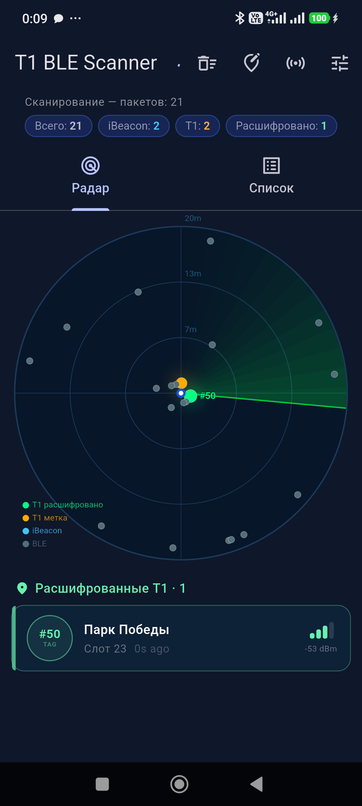
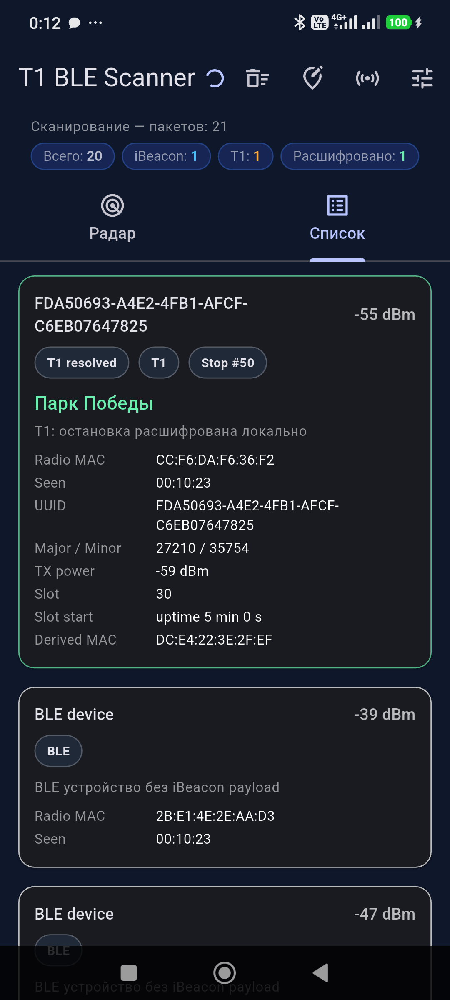
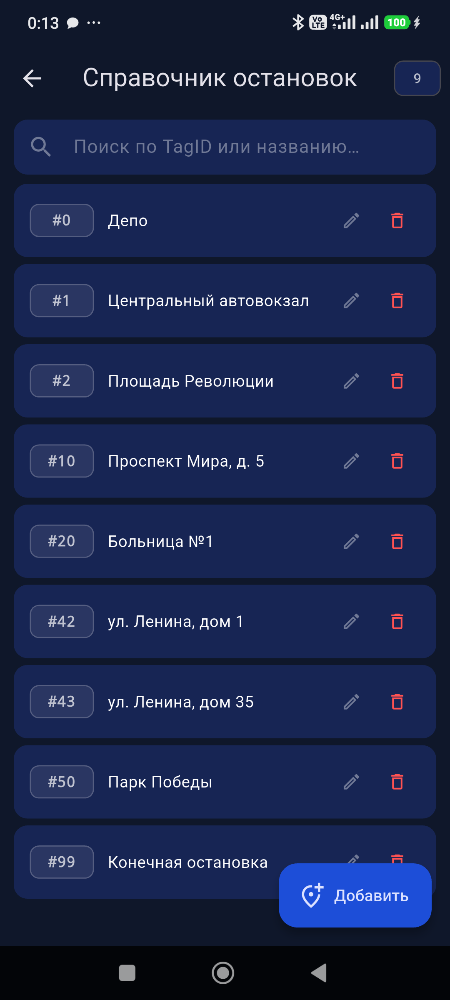
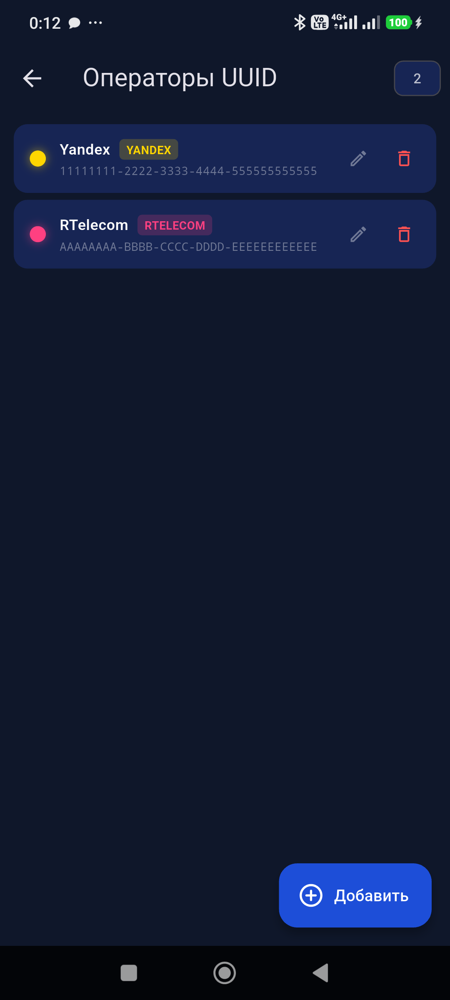
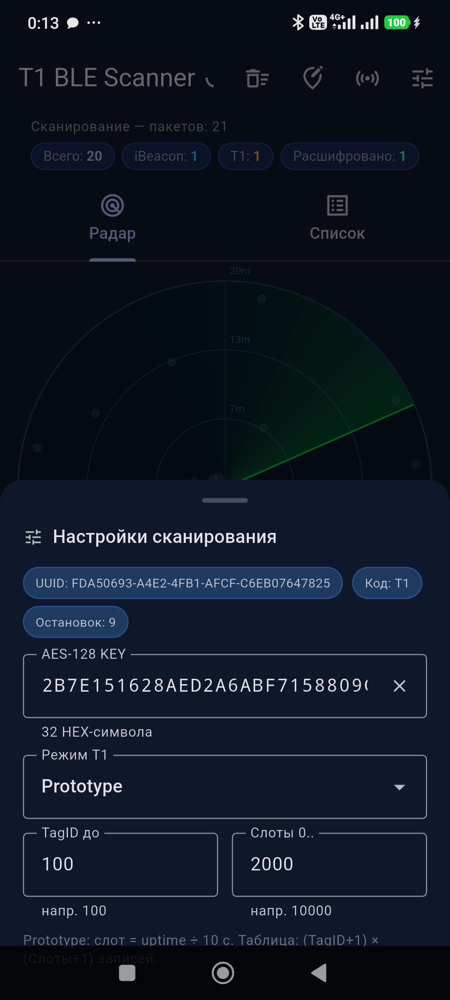
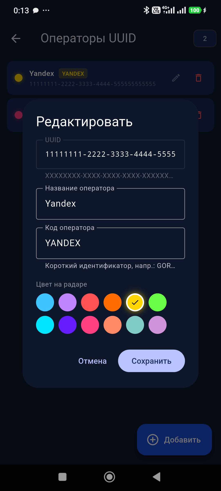

# T1 BLE Scanner

Офлайн Flutter-приложение для локального сканирования BLE-меток транспортной системы T1.

📄 **[Product Page (PDF)](docs/T1_BLE_Scanner_Product.pdf)**

---

## Возможности

| Функция | Описание |
|---|---|
| 🔵 **BLE-сканирование** | Обнаруживает все iBeacon-устройства в радиусе действия |
| 🟠 **Распознавание T1** | Определяет метки T1 по UUID и запускает локальную дешифровку |
| 🟢 **AES-128 ECB дешифровка** | Восстанавливает TagID и номер слота без сетевых вызовов |
| 📡 **Радар-вид** | Живой радар с позиционированием по RSSI и цветовой кодировкой |
| 📋 **Список устройств** | Детальные карточки: UUID, major/minor, derived MAC, слот, время |
| 🛑 **Справочник остановок** | Редактируемый TagID → название, сохраняется между сессиями |
| 🔷 **Реестр операторов** | UUID → код оператора с выбором цвета на радаре |
| ⚙️ **Настройки** | AES-128 ключ, режим Prototype/Production, диапазон TagID |

## Скриншоты

<table>
<tr>
<td><br><sub>Радар</sub></td>
<td><br><sub>Список устройств</sub></td>
<td><br><sub>Справочник остановок</sub></td>
</tr>
<tr>
<td><br><sub>Операторы UUID</sub></td>
<td><br><sub>Настройки сканирования</sub></td>
<td><br><sub>Выбор цвета оператора</sub></td>
</tr>
</table>

## Структура проекта

```
lib/
├── src/
│   ├── models/
│   │   ├── app_config.dart          # Конфиг приложения (UUID, операторы, остановки)
│   │   └── beacon_view_model.dart   # ViewModel BLE-устройства
│   ├── services/
│   │   ├── ble_scanner_controller.dart  # BLE-сканирование + дешифровка T1
│   │   ├── t1_crypto.dart               # AES-128 ECB + таблица поиска
│   │   ├── stops_repository.dart        # CRUD справочника остановок
│   │   └── operators_repository.dart    # CRUD реестра операторов
│   ├── ui/
│   │   ├── scanner_page.dart        # Главная страница (радар + список)
│   │   ├── radar_view.dart          # Анимированный радар (CustomPainter)
│   │   ├── stops_editor_page.dart   # Редактор справочника остановок
│   │   ├── operators_editor_page.dart # Редактор реестра операторов
│   │   ├── settings_sheet.dart      # Настройки сканирования (bottom sheet)
│   │   └── tag_id_panel.dart        # Панель расшифрованных тегов
│   └── utils/
│       └── beacon_utils.dart        # UUID-нормализация, форматирование
assets/
└── config/
    └── app_config.json              # UUID T1, внешние операторы, остановки, дефолты
docs/
├── screenshots/                     # Скриншоты всех экранов
├── T1_BLE_Scanner_Product.pdf       # Product page (PDF)
└── make_pdf.py                      # Скрипт генерации PDF
```

## Запуск

```bash
cd mobile/t1_ble_scanner
flutter pub get
flutter run -d <device_id> --release
```

Требования: Flutter 3.x, Android 6.0+ (API 23), BLE-поддержка, разрешение `BLUETOOTH_SCAN`.

## Конфигурация

`assets/config/app_config.json`:

```json
{
  "local": { "uuid": "FDA50693-...", "name": "T1", "code": "T1" },
  "external": [
    { "uuid": "XXXXXXXX-...", "name": "Оператор", "code": "OPR" }
  ],
  "stops": { "50": "Парк Победы", "42": "ул. Ленина, дом 1" },
  "defaults": {
    "keyHex": "2B7E151628AED2A6ABF7158809CF4F3C",
    "tagMax": 100,
    "productionSlotWindow": 5,
    "prototypeSlotMax": 2000
  }
}
```

## Технические детали

- **AES-128 ключ** расширяется один раз, раундовые ключи переиспользуются — дешифровка ~5–10× быстрее наивной реализации
- **Изоляты Dart** (`compute()`): тяжёлые AES-вычисления не блокируют UI-поток
- **Дебаунс уведомлений** 100 мс: не более 10 перестроек UI в секунду при интенсивном потоке пакетов
- **Ориентация**: фиксирована в портретной — `android:screenOrientation="portrait"`
- **Хранение**: `SharedPreferences` для справочника остановок и реестра операторов
