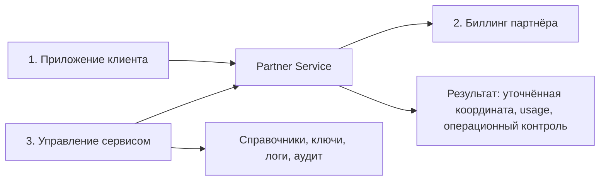

# Service Overview

Партнёрский сервис предоставляет доверенный API для уточнения координат транспортного средства в точках, где спутниковая навигация недостаточно точна. Сервис использует уже развёрнутую BLE-инфраструктуру на остановках общественного транспорта и возвращает партнёру уточнённую координату, идентификатор объекта и оценку достоверности.

## Ценность сервиса

- повышает точность фиксации остановок и проездов в сложной городской среде;
- не раскрывает статические идентификаторы объектов в эфире;
- позволяет монетизировать существующую инфраструктуру через B2B-модель доступа;
- сокращает сроки интеграции за счёт стандартного API, Sandbox и готовых SDK-паттернов.

## Диаграмма взаимодействия

## Целевые сегменты

- таксопарки и агрегаторы;
- логистические и навигационные платформы;
- региональные транспортные операторы;
- государственные и окологосударственные интеграторы.
