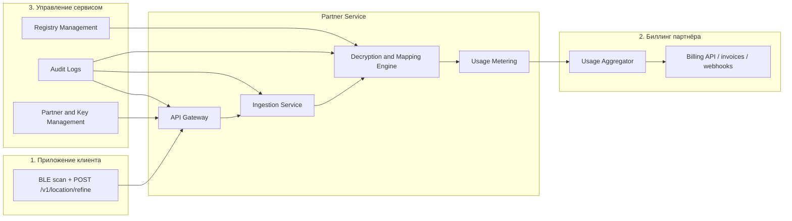

# System Architecture

Сервис построен вокруг цепочки `API Gateway -> Ingestion Service -> Decryption and Mapping Engine -> Usage Metering`. Он принимает BLE-пакет от клиентского приложения, валидирует запрос, сопоставляет динамические идентификаторы с региональным справочником и возвращает уточнённую координату. Параллельно формируются usage-события для биллинга и операционного мониторинга.

## Диаграмма взаимодействия

## Основные компоненты

- `API Gateway` отвечает за аутентификацию, маршрутизацию и rate limiting.
- `Ingestion Service` валидирует payload, временное окно и технические ограничения запроса.
- `Decryption and Mapping Engine` дешифрует динамические идентификаторы и получает объект из справочника.
- `Usage Metering` публикует агрегируемые события для квотирования и биллинга.
- `Monitoring and Audit` собирает метрики, трейсы и журналы доступа.
