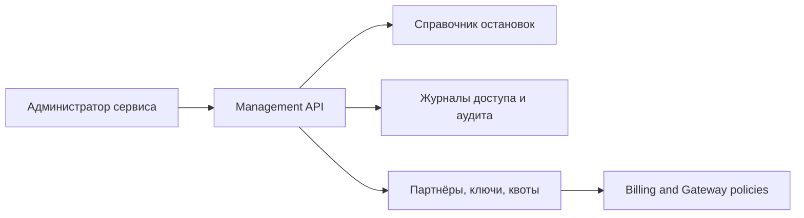

# Service Management

Административный контур предназначен для ведения справочников, просмотра журналов, управления партнёрами, ключами и эксплуатационными ограничениями.

## Диаграмма взаимодействия

## Основные функции

- ведение справочника объектов и версий маппинга;
- просмотр access и audit логов;
- управление ключами, `client_id` и статусами партнёров;
- контроль квот, блокировок и эксплуатационных ограничений;
- подготовка данных для аудита и расследований.

## Базовые роли

- администратор сервиса;
- оператор поддержки;
- специалист по безопасности;
- оператор справочников;
- финансовый оператор биллинга.
